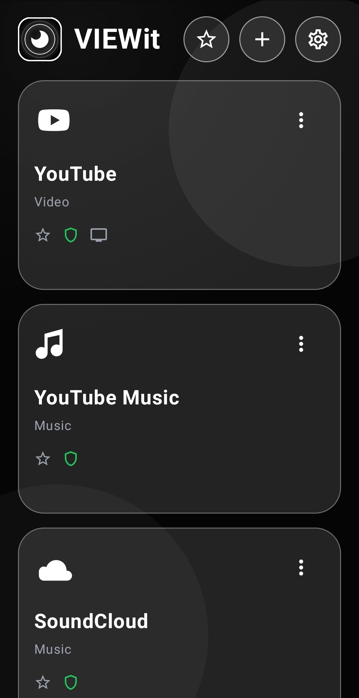
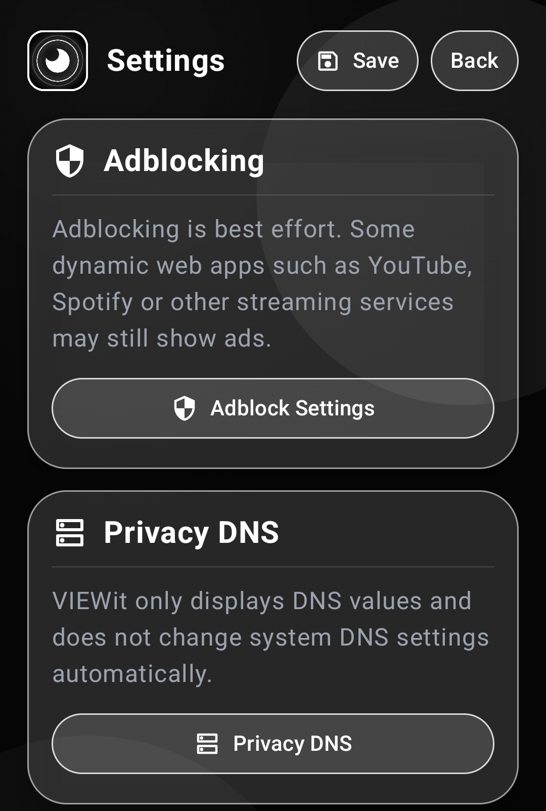
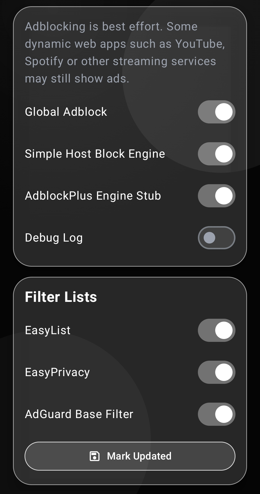
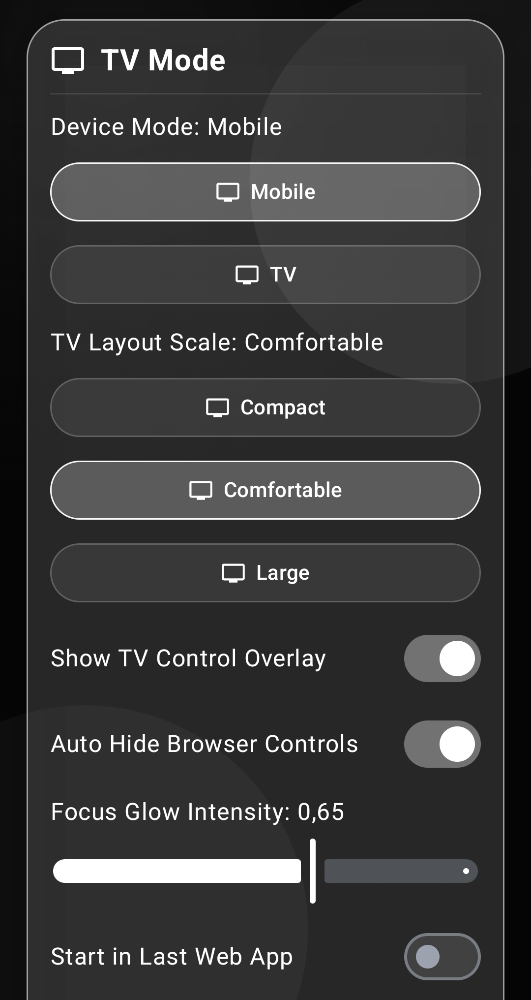

# VIEWit Android Web-App Hub

VIEWit is a local Android WebView hub for mobile Android devices and Android TV devices. 
It bundles selected web apps, privacy notes, adblocking controls, TV controls and custom web-library cards into one focused Android app.
VIEWit is a lightweight android media player for YouTube, SoundCloud, and other platforms, featuring a built-in ad blocker.

---

## Quick start

### Download the pre-built APK

The easiest way to use VIEWit is to download the pre-built APK from the GitHub releases page:

```text
https://github.com/complicatiion/VIEWit/releases
```

Install the APK on your Android device, allow installation from the selected source if Android asks for it, and start VIEWit from the launcher.

---

## Work in Progress (WIP)
This repository/module is under active development. 
- Features may be experimental and break between commits.
- Documentation might be missing or incomplete.
- Contributions and feedback are welcome, but please open an issue before major pull requests.

---

## Previews






---

### Build from source

Clone or download the repository:

```bash
git clone https://github.com/complicatiion/VIEWit.git
```

Open the project in Android Studio and run:

```bash
./gradlew :app:assembleDebug
```

On Windows with the Gradle wrapper available:

```cmd
gradlew.bat :app:assembleDebug
```

The generated debug APK is created under:

```text
app/build/outputs/apk/debug/
```

---

## Requirements

- Android Studio with Kotlin and Android Gradle Plugin support
- JDK 17
- Android SDK / compile SDK matching the project configuration
- Android 10 or newer for the app target workflow
- Android WebView installed and enabled on the device
- Internet access for the web apps opened inside VIEWit

VIEWit does not require a backend server, cloud converter, external CDN asset or telemetry service.

---

## What VIEWit does

VIEWit provides a WebView-based launcher for web applications. It is designed for services and websites that are useful inside a focused app shell.

Default library cards include:

| Card | Purpose |
|---|---|
| YouTube | Video web app access |
| YouTube Music | Music web app access |
| SoundCloud | Music and audio web app access |
| Spotify | Spotify web player access |
| Custom Web Apps | User-defined web-library cards |

VIEWit is not a native replacement for those services. It opens their official web interfaces inside Android WebView.

---

## Main features

### Web-library cards

VIEWit starts with predefined cards and allows custom web apps to be added. Each card can store its own settings, including:

- name
- main URL
- mobile URL
- TV / desktop URL
- category
- icon style
- JavaScript setting
- desktop view setting
- adblocking setting
- cookies setting
- DOM storage setting
- cache setting
- favorite state

The card menu can be used to open, edit, duplicate, favorite and reorder cards.

---

### Mobile mode and TV mode

VIEWit supports two device modes:

| Mode | Behavior |
|---|---|
| Mobile | Optimized for touch, portrait use and mobile web layouts. |
| TV | Optimized for landscape use, remote control navigation and desktop / TV web layouts. |

Mobile mode is the default. TV mode can be enabled manually in the app settings.

TV mode includes larger focus targets, remote-friendly navigation, a TV browser control overlay and D-pad / keyboard-oriented controls.

---

### Browser controls

Inside a web app, VIEWit provides browser controls such as:

- back
- forward
- reload
- app home / web-library menu
- external browser open
- desktop view toggle
- adblock toggle
- cache and site-data controls

On TV devices, the browser overlay is designed to be reachable with D-pad, Enter and remote-control buttons.

---

### Favorites

Cards can be marked as favorites. The star button in the main toolbar filters the library view to favorites only.

---

### Adblocking

VIEWit includes a best-effort adblocking architecture.

Included engines:

| Engine | Purpose |
|---|---|
| NoOpAdblockEngine | Safe fallback that blocks nothing. |
| SimpleHostBlockEngine | Lightweight host/domain based blocking. |
| AdblockPlusEngine | Stub prepared for optional future AdblockPlus integration. |

Adblocking is best effort. Some dynamic web apps such as YouTube, Spotify, SoundCloud or other streaming services may still show ads.

VIEWit does not bundle a full AdblockPlus binary by default.

---

### Privacy DNS information

VIEWit includes a Privacy DNS information screen with DNSforge values and copy buttons.

Important: VIEWit does not change Android Private DNS settings automatically. Android Private DNS must be configured manually in the Android system settings.

The app can open the Android Private DNS settings screen where supported by the device.

---

### Notification Player

VIEWit includes an optional Notification Player setting. When enabled, the app can show a media-style notification for currently opened web content.

Notification controls are best effort because playback control support depends on the web app, Android WebView and the service loaded inside the WebView.

---

### Import and export

VIEWit supports local configuration workflows for:

- web-library JSON export
- web-library JSON import
- settings JSON export
- settings JSON import
- user rules TXT export / import
- filter-list configuration export / import

Import routines should be reviewed before replacing existing data.

---

## Basic usage

### Open a default web app

1. Start VIEWit.
2. Tap a card such as YouTube, YouTube Music, SoundCloud or Spotify.
3. Use the top controls to go back, reload, return to the library or open the current page externally.

### Add a custom web app

1. Tap the plus button in the main toolbar.
2. Enter a name and URL.
3. Select an icon style.
4. Configure per-app settings such as JavaScript, adblocking, desktop view and cache behavior.
5. Save the card.

### Edit a card

1. Open the three-dot menu on a card.
2. Choose **Edit**.
3. Adjust the card settings.
4. Save the changes.

### Use favorites

1. Open the three-dot menu on a card.
2. Mark it as favorite.
3. Use the star button in the toolbar to show only favorites.

### Enable TV mode

1. Open Settings.
2. Open the TV Mode section.
3. Set Device Mode to TV.
4. Adjust layout scale, control overlay and remote input settings as needed.

---

## Recommended Android settings

For best results:

- keep Android WebView updated
- allow notification permission if the Notification Player should be used
- disable battery restrictions if media playback should continue reliably
- use the device browser externally if a website blocks or limits WebView playback
- configure Android Private DNS manually if DNSforge or another DNS provider should be used system-wide

---

## Permissions

VIEWit uses only the permissions required for its app scope.

| Permission | Purpose |
|---|---|
| `android.permission.INTERNET` | Opens web apps inside Android WebView. |
| `android.permission.ACCESS_NETWORK_STATE` | Checks network availability. |
| `android.permission.POST_NOTIFICATIONS` | Enables the optional Notification Player on Android versions that require notification permission. |

VIEWit does not require location permission, root access or VPN access.

---

## Privacy notes

VIEWit is designed as a local WebView container.

- No telemetry is intentionally included.
- No cloud conversion is included.
- No hidden backend service is required.
- DNS settings are not changed automatically.
- External websites opened inside WebView may use their own cookies, trackers, accounts, scripts, terms and privacy policies.
- Website login behavior depends on Android WebView, cookies and the external service.

---

## Known limitations

- Some streaming services may limit functionality inside Android WebView.
- Some websites may force desktop or mobile layouts independently of VIEWit settings.
- Notification playback controls are best effort and may not work with every website.
- Adblocking is best effort and not equivalent to a full browser extension engine.
- Android TV behavior depends on the device, remote control, Android version and WebView implementation.
- Websites can change their layout at any time, which may require app-side adjustments.

---

## Third-party services

VIEWit can open third-party websites such as YouTube, YouTube Music, SoundCloud and Spotify.

These services, their names, logos, trademarks, content, playback systems, web interfaces and terms belong to their respective owners.

VIEWit is independent and is not affiliated with, sponsored by or endorsed by those services.

---

## Third-party licenses

Third-party dependency and technology notes are documented in:

```text
THIRD_PARTY_LICENSES.md
```

This includes AndroidX, Jetpack Compose, Material 3, Kotlin, Android WebView notes, optional AdblockPlus integration notes and external service disclaimers.

---

## License

VIEWit is provided under a custom non-commercial attribution license.

See:

```text
LICENSE.md
```

Review the license before redistribution, publication, packaging, commercial use or app-store distribution.

---

## Author

```text
complicatiion aka sksdesign aka sven404
```

Repository:

```text
https://github.com/complicatiion/VIEWit
```

---

### © complicatiion aka sksdesign · 2026
